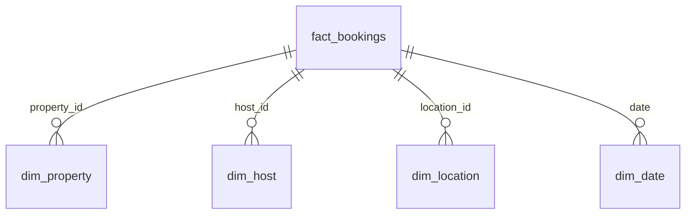

# airbnb-powerbi-analytics
  An interactive Power BI dashboard built on Airbnb booking, host, and property data to analyze revenue performance, occupancy, and host quality across markets.
  ---

## 📌 Project Overview

This project analyzes Airbnb listing and booking data to help hosts and platform stakeholders understand what drives revenue and occupancy. The dashboard consolidates booking, host, property, and location data into a single model and surfaces key performance indicators across two report pages.

**Business questions answered:**
- Which markets, neighbourhoods, and room/property types generate the most revenue?
- How does occupancy rate trend over time, and which factors correlate with it?
- Which hosts perform best on revenue, review score, and cancellation rate?
- What is the relationship between host/property attributes and booking performance?

---## 🗂️ Data Model

Data is structured as a **star schema** for optimal query performance and simplified DAX logic, with one fact table and four dimension tables.

| Table | Role | Description |
|---|---|---|
| `fact_bookings` | Fact | Grain-level booking transactions (revenue, nights, cancellations) |
| `dim_property` | Dimension | Property attributes — `property_type`, `room_type` |
| `dim_host` | Dimension | Host attributes — `host_name`, `superhost_flag` |
| `dim_location` | Dimension | Geography — `neighbourhood` |
| `dim_date` | Dimension | Calendar table — `year`, `month_name`, `month_num` |

A dedicated measures table (`Core Revenue KPI | Occupancy`) holds all DAX calculations, keeping business logic separate from raw data.

---

## 📐 Key DAX Measures

| Measure | Purpose |
|---|---|
| `Total Revenue` | Sum of booking revenue |
| `Revenue PY` | Prior-year revenue (time intelligence) |
| `Avg Revenue Per Booking` | Revenue efficiency per booking |
| `Occupancy Rate` | % of available nights booked |
| `Avg Night Rate` | Average nightly price |
| `RevPAR` | Revenue per available room/listing |
| `Cancellation Rate` | % of bookings cancelled |
| `Avg Review Score` | Average guest review rating |
| `Total Booking` | Count of bookings |

---
## 📊 Report Pages

**1. Overview**
KPI cards, revenue trend (line chart), revenue by category (bar/column charts), and booking mix (donut chart), with slicers for dynamic filtering.

**2. Host and Property**
Deep-dive analysis using a decomposition tree and scatter chart to explore relationships between host/property attributes (e.g., superhost status, room type) and performance metrics, backed by a detailed data table.
